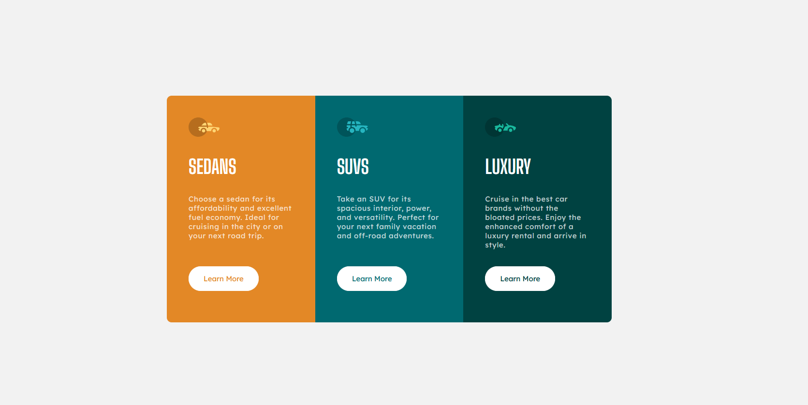

# Frontend Mentor - 3-column preview card component solution

This is a solution to the [3-column preview card component challenge on Frontend Mentor](https://www.frontendmentor.io/challenges/3column-preview-card-component-pH92eAR2-). Frontend Mentor challenges help you improve your coding skills by building realistic projects. 

## Table of contents

- [Overview](#overview)
  - [The challenge](#the-challenge)
  - [Screenshot](#screenshot)
  - [Links](#links)
- [My process](#my-process)
  - [Built with](#built-with)
  - [What I learned](#what-i-learned)
- [Author](#author)
- [Acknowledgments](#acknowledgments)

## Overview

### The challenge

Users should be able to:

- View the optimal layout depending on their device's screen size
- See hover states for interactive elements

### Screenshot

### Links

- Solution URL: [Github solution repo](https://github.com/wonszfill/3_Column_Preview_Card_Component)

## My process

### Built with

- Semantic HTML5 markup
- CSS custom properties
- Flexbox
- CSS Grid
- Mobile-first workflow

### What I learned

I started to like css grid more, and not substitute it with flexbox. 
Using the grid I was able to avoid @media tag for mobile/desktop styling.

## Author

- Website - [Przemek Wojszwiłło](https://github.com/wonszfill)
- Frontend Mentor - [@wonszfill](https://www.frontendmentor.io/profile/wonszfill)

## Acknowledgments

Great thanks to stackoverflow community and frontend mentor for creating the challenge.